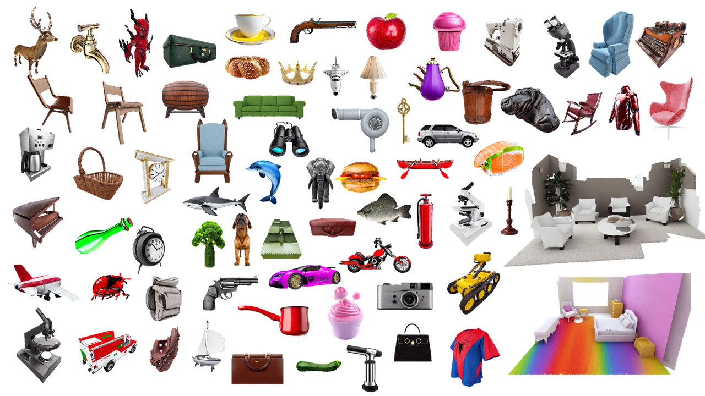
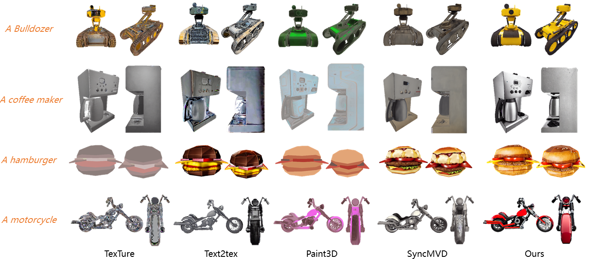
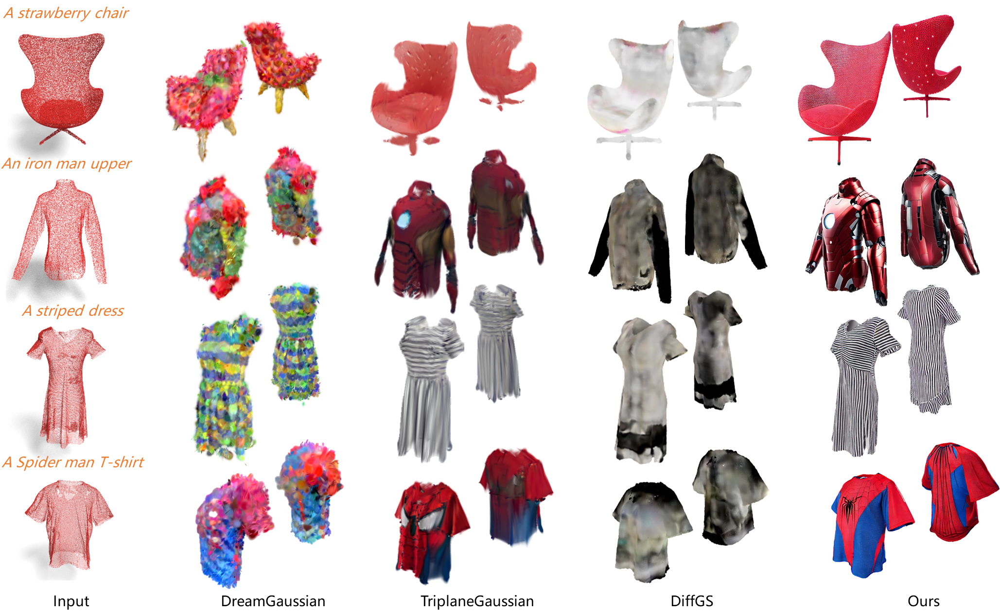
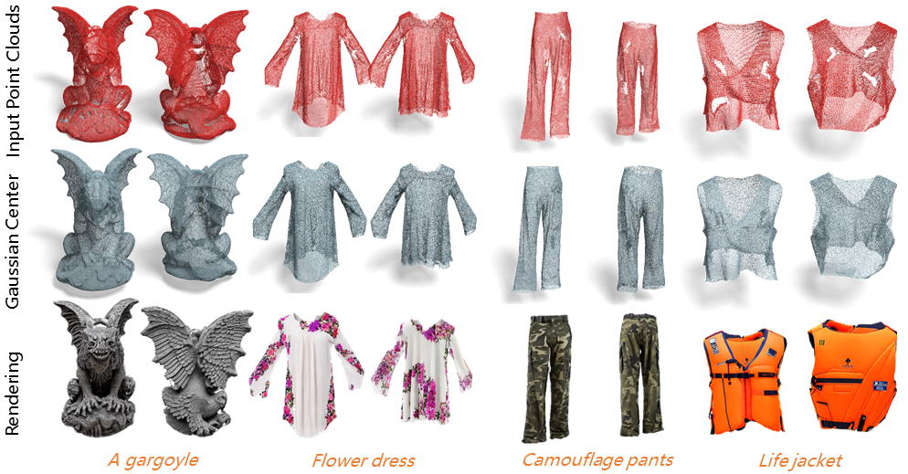
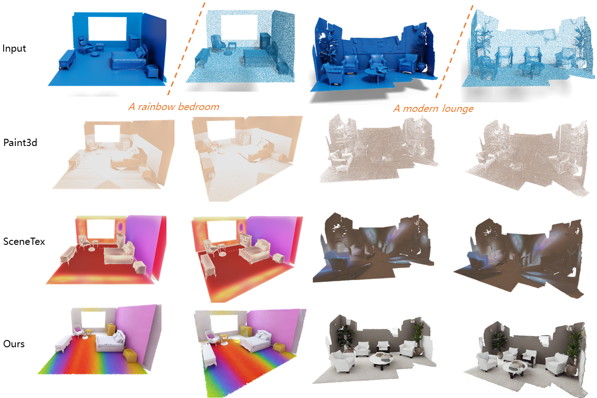
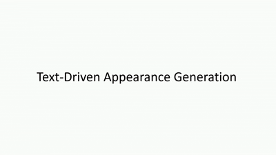

<h1 align="center">GAP: Gaussianize Any Point Clouds with Text Guidance  
(ICCV 2025)</h1>

    <a href="https://weiqi-zhang.github.io/"><strong>Weiqi Zhang*</strong></a>
    ·
    <a href="https://junshengzhou.github.io/"><strong>Junsheng Zhou*†</strong></a>
    ·
    <a href="https://github.com/mts246/"><strong>Haotian Geng*</strong></a>
    ·
    <a href="https://wen-yuan-zhang.github.io/"><strong>Wenyuan Zhang</strong></a>
    ·
    <a href="https://yushen-liu.github.io/"><strong>Yu-Shen Liu†</strong></a>

<strong>(* Equal Contribution † Corresponding Author)</strong>

<h3 align="center"><a href="https://yushen-liu.github.io/main/pdf/LiuYS_ICCV25_GAP.pdf">Paper</a> | <a href="https://weiqi-zhang.github.io/GAP/">Project Page</a></h3>

    

We will release the code of the paper <a href="https://weiqi-zhang.github.io/GAP/">GAP: Gaussianize Any Point Clouds with Text Guidance</a> in this repository.

## Abstract

In this work, we introduce GAP, a novel method for transforming raw, colorless 3D point clouds into high-quality Gaussian representations guided by text. Although 3D Gaussian Splatting (3DGS) has demonstrated impressive rendering capabilities, it remains challenging to convert sparse and uncolored point clouds into meaningful Gaussian forms. GAP effectively addresses this issue, performing robustly across a wide range of scenarios, including synthetic datasets, real-world scans, and large-scale scenes. It provides a reliable and versatile solution for point-to-Gaussian conversion.
          

## Method

  

<strong>Overview of GAP.</strong>
            <strong>(a)</strong> We rasterize the Gaussians through an unprocessed view, where a depth-aware image diffusion model is used to generate consistent appearances using the rendered depth and mask with text guidance. The mask is dynamically classified as generate, keep, or update based on viewing conditions. <strong>(b)</strong> The Gaussian optimization includes three constraints: the Distance Loss and Scale Loss introduced to ensure geometric accuracy, and the Rendering Loss that ensures high-quality appearance. <strong>(c)</strong> The Gaussian inpainting strategy which diffuses the geometric and appearance information from visible regions to hard-to-observe areas, considering local density, spatial proximity and normal consistency.

## Generation Results

### Visual Comparison of Text-Guided Generation

### Point to Gaussian

### Results on Corrupted Data

### Scale to Secene Level

## Visualization Results

## Citation

If you find our code or paper useful, please consider citing

    @inproceedings{gap,
          title={GAP: Gaussianize Any Point Clouds with Text Guidance},
          author={Zhang, Weiqi and Zhou, Junsheng and Geng, Haotian and Zhang, Wenyuan and Liu, Yu-Shen},
          booktitle={Proceedings of the IEEE/CVF international conference on computer vision},
          year={2025}
        }
